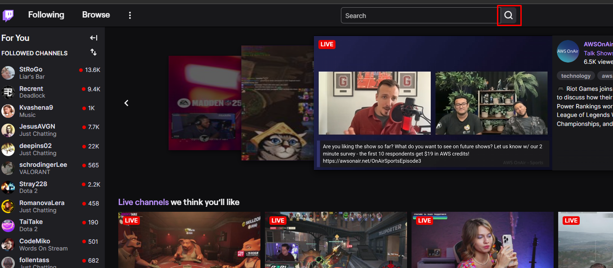
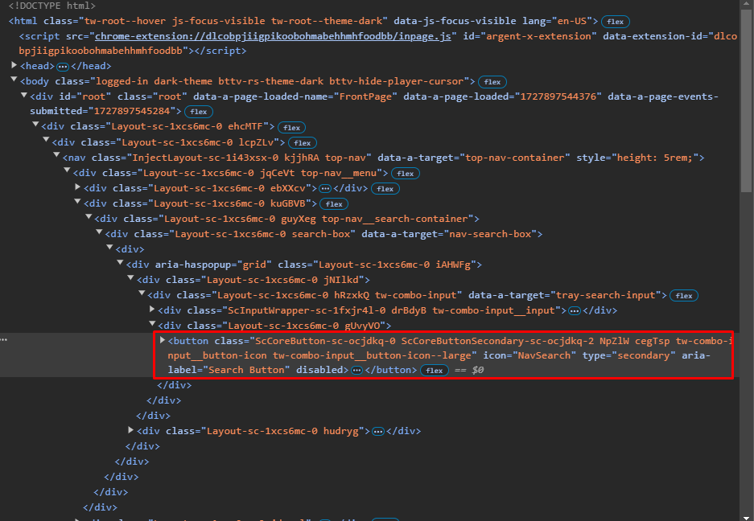
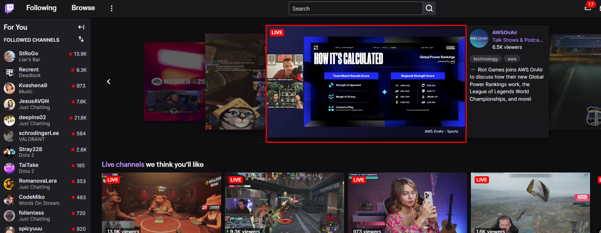
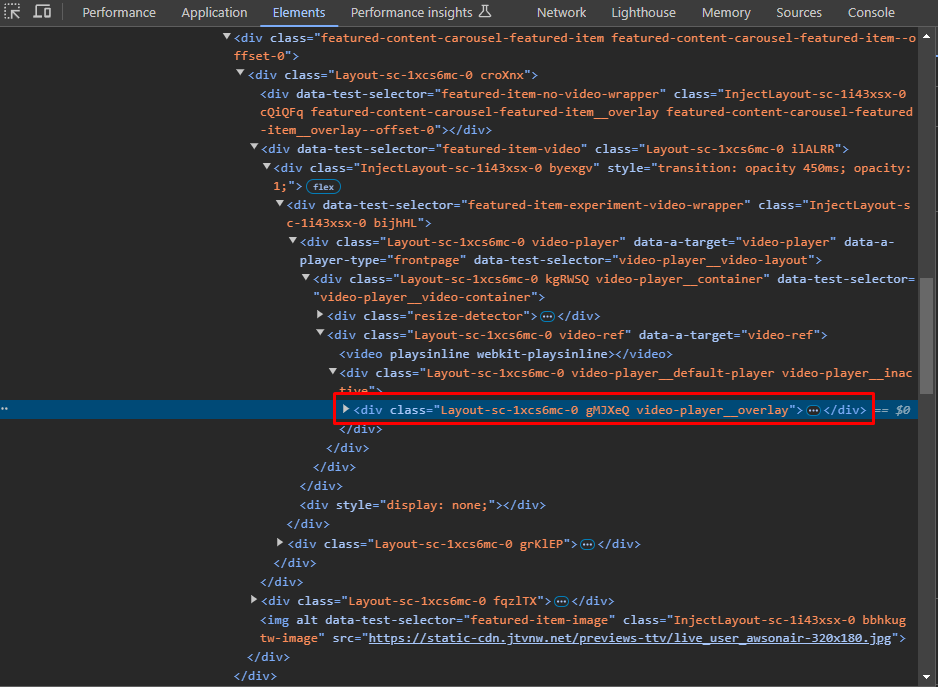
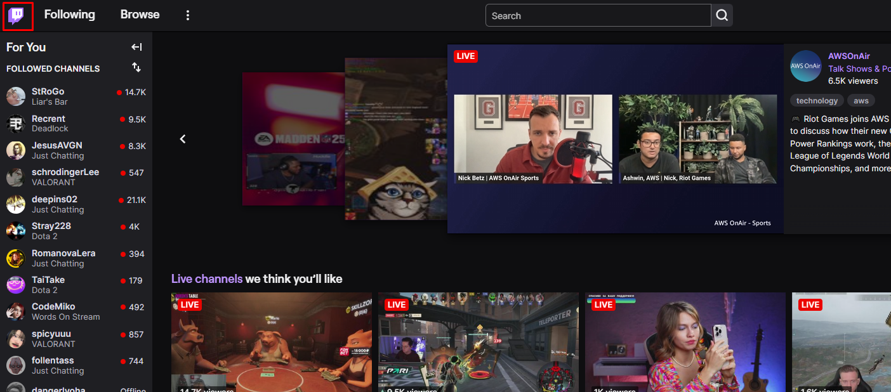
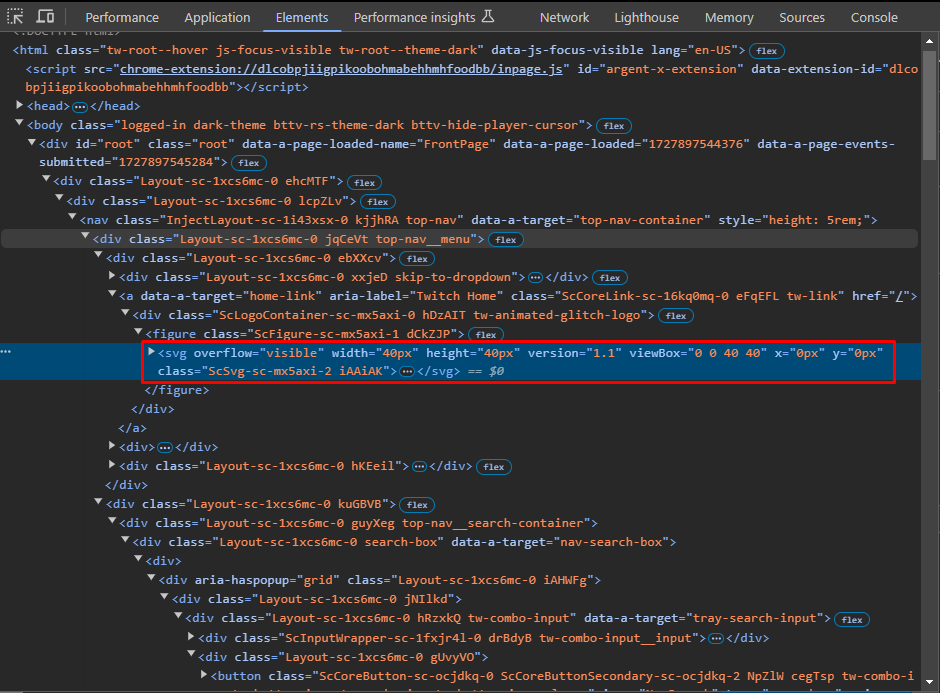

> For the task, I chose the website https://www.twitch.tv/

## Search button element

### Ui screenshot

### HTML screenshot

### CSS Locator
#root > div > div.Layout-sc-1xcs6mc-0.lcpZLv > nav > div > div.Layout-sc-1xcs6mc-0.kuGBVB > div > div > div > div > div.Layout-sc-1xcs6mc-0.jNIlkd > div > div.Layout-sc-1xcs6mc-0.gUvyVO > button

### xPath Locator
//*[@id="root"]/div/div[1]/nav/div/div[2]/div/div/div/div/div[1]/div/div[2]/button

## Slider active player element

### Ui screenshot

### HTML screenshot

### CSS Locator
#root > div > div.Layout-sc-1xcs6mc-0.lcpZLv > div > main > div.root-scrollable.scrollable-area.scrollable-area--suppress-scroll-x > div.simplebar-scroll-content > div > div > div > div.Layout-sc-1xcs6mc-0.hTjsXl.front-page-carousel > div.featured-content-carousel__wrapper > div > div.featured-content-carousel__item-container.featured-content-carousel__item-container--description.featured-content-carousel__item-container--offset-0.featured-content-carousel__item-container--center > div > div > div > div.Layout-sc-1xcs6mc-0.ilALRR > div > div.InjectLayout-sc-1i43xsx-0.bijhHL > div.Layout-sc-1xcs6mc-0.video-player > div > div.Layout-sc-1xcs6mc-0.video-ref > div > div

### xPath Locator
//*[@id="root"]/div/div[1]/div/main/div[1]/div[3]/div/div/div/div[1]/div[2]/div/div[5]/div/div/div/div[2]/div/div[1]/div[1]/div/div[2]/div/div

## Twitch logo element

### Ui screenshot

### HTML screenshot

### CSS Locator
#root > div > div.Layout-sc-1xcs6mc-0.lcpZLv > nav > div > div.Layout-sc-1xcs6mc-0.ebXXcv > a > div > figure > svg

### xPath Locator
//*[@id="root"]/div/div[1]/nav/div/div[1]/a/div/figure/svg